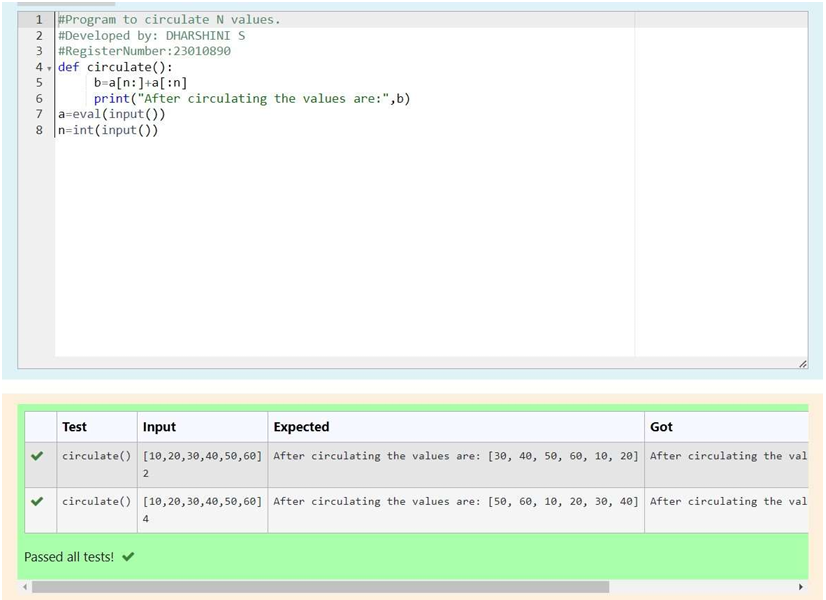

# Circulate-the-values-of-N-variables
## Aim:
To write a python program to circulate the n variables using function concept
## Equipment’s required:
PC
Anaconda - Python 3.7
## Algorithm: 
### Step 1:
Get the input from the user 
### Step 2:
Type the function to circulate the values 
### Step 3: 
Get the value from the user for the number of rotation
### Step 4: 
Using the slicing concept rotate the list

### Step 5: 
Print the circulated values
### Step 6:
 End the program
## Program:
```python
#Program to circulate N values.
#Developed by: DHARSHINI S
#RegisterNumber:23010890
def circulate():
     b=a[n:]+a[:n]
     print("After circulating the values are:",b)
a=eval(input())
n=int(input())
```

## Output:


## Result:
